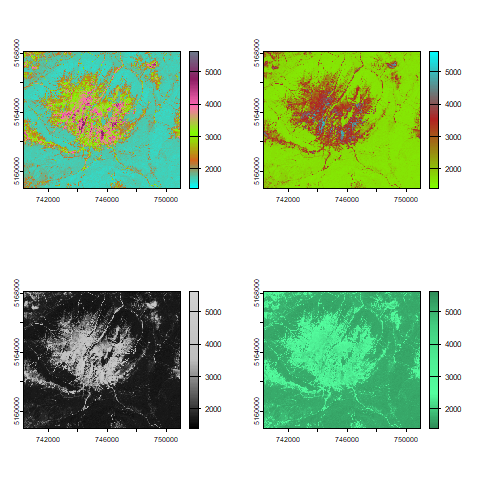

# PR_stats_live_2
This is a repo storing the code from PR stats course on remote sensing
## Example of code
With the following code, we can attain the following image:

``` r
png("nameoftheimage.png")
plot(b2)
dev.off()
```


``` r
png("mygraph2.png")
par(mfrow=c(2,2))
cl <- colorRampPalette(c("cyan","chocolate","chartreuse","hotpink","maroon4","slategray4"))(100)
plot(b2, col=cl)
cl <- colorRampPalette(c("chartreuse","firebrick","cyan"))(100)
plot(b2, col=cl)
cl <- colorRampPalette(c("black","grey","light grey"))(100)
plot(b2, col=cl)
cl <- colorRampPalette(c("seagreen","seagreen1","seagreen2","seagreen3","seagreen4"))(100)
plot(b2, col=cl)
dev.off()
```


